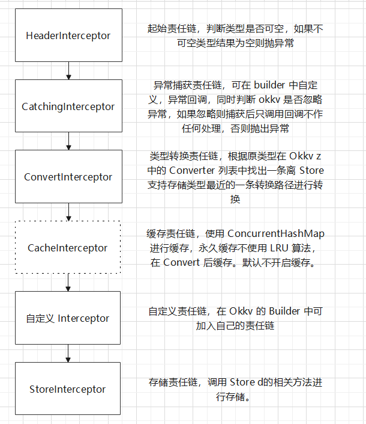

### OKKV2 使用文档

[返回目录](./menu.md)

#### 拦截链

OKKV2 采用拦截链模式，具体有以下拦截链：



#### 异常拦截器

可自定义异常拦截器回调，并且使用 ignoreException 指定是否忽略异常。
无论是否忽略异常 onCatching 都会执行，但如果不忽略异常，则发生异常时会抛出（直接在存储地方抛出）

```kotlin
Okkv.Builder()
    .store(MMKVStore(this)) // 使用 MMKV 储存
    .catchingChain(object: CatchingInterceptor (){
        override fun onCatching(throwable: Throwable) {
            // 异常回调
            // 无论是否忽略都会回调
        }
    })
    .ignoreException(true) // 是否忽略异常
    .build() // 创建 Okkv 对象
    .init() // 初始化
```

#### 自定义拦截器

可以使用自定义拦截器：

```kotlin
Okkv.Builder()
    .store(MMKVStore(this)) // 使用 MMKV 储存
    // 添加打印拦截器
    .addInterceptorChain(object: Interceptor(){
        override fun <T : Any> get(okkvValue: OkkvValue<T>): T? {
            Log.i("okkv", "<< ${okkvValue.key()}")
            // 记得调用 next
            return next?.get(okkvValue)
        }

        override fun <T : Any> set(okkvValue: OkkvValue<T>, value: T?) {
            Log.i("okkv", "$value >> ${okkvValue.key()}")
            // 记得调用 next
            next?.set(okkvValue, value)
        }
    })
    .build() // 创建 Okkv 对象
    .init() // 初始化
    .default("mmkv") // 作为默认，key 为 mmkv
```

